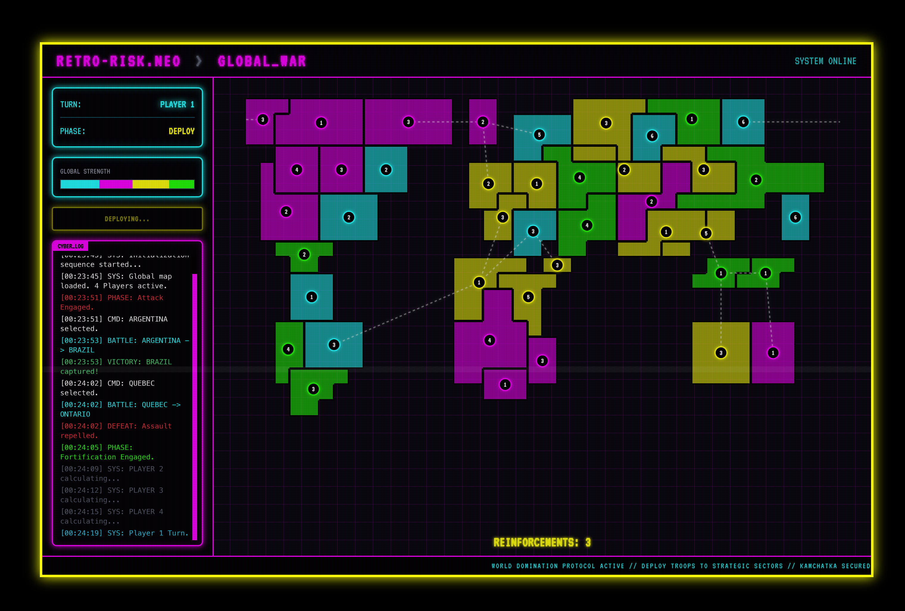

# hex-war

Hex War is a modern, web-based turn-based strategy game inspired by the classic board game Risk. Built with pure JavaScript, HTML, and CSS, it offers a fast, responsive, and engaging experience directly in your browser. The goal is simple: achieve world domination by strategically eliminating your opponents from the grid-based map.



## ✨ Features

*   **Classic Risk Gameplay**: Follows the core phases of Reinforce, Attack, and Fortify.
*   **Dynamic AI Opponents**: Play against one to four AI players with strategic decision-making.
*   **Interactive SVG Map**: A clean, grid-based world map with smooth pan and zoom controls.
*   **Sleek UI**: A modern, dark-themed interface built with Tailwind CSS, including modals for battles, fortifications, and game status.
*   **Real-time Visuals**: See territories change hands instantly and watch the balance of power shift with an animated top bar.
*   **Zero Dependencies**: Built with vanilla JavaScript (ES6 Modules) for a lightweight and fast-loading experience. No frameworks needed.

## 🚀 Getting Started

You can play the game by simply opening the `index.html` file in any modern web browser.

For development, it's recommended to run a simple local server to handle ES6 modules correctly.

1.  **Clone the repository:**
    ```bash
    git clone https://github.com/radekstepan/hex-war.git
    cd hex-war
    ```

2.  **Start a local server:**
    If you have Python installed, you can easily start a server:
    ```bash
    # For Python 3
    python -m http.server
    ```
    Or use the popular `live-server` VS Code extension.

3.  **Open in your browser:**
    Navigate to `http://localhost:8000` (or the address provided by your server).

## 🎮 How to Play

1.  **Game Setup**: On the startup screen, choose the number of AI opponents you wish to challenge.
2.  **Reinforce**: At the beginning of your turn, you will receive armies based on the number of territories you control and any continent bonuses. Click on your territories to place your new armies.
3.  **Attack**: Select one of your territories with more than one army to initiate an attack. Then, click on an adjacent enemy territory to begin the battle. A modal will appear where you can roll dice to resolve the conflict.
4.  **Fortify**: After you have finished attacking, you may move armies from one of your territories to another connected territory once per turn.
5.  **Win**: The game is over when you have successfully eliminated all other players and conquered every territory on the map.

## 🛠️ Tech Stack

*   **Frontend**: HTML5, CSS3, Vanilla JavaScript (ES6 Modules)
*   **Styling**: [Tailwind CSS](https://tailwindcss.com/) (via CDN for simplicity)
*   **Graphics**: SVG for map rendering
