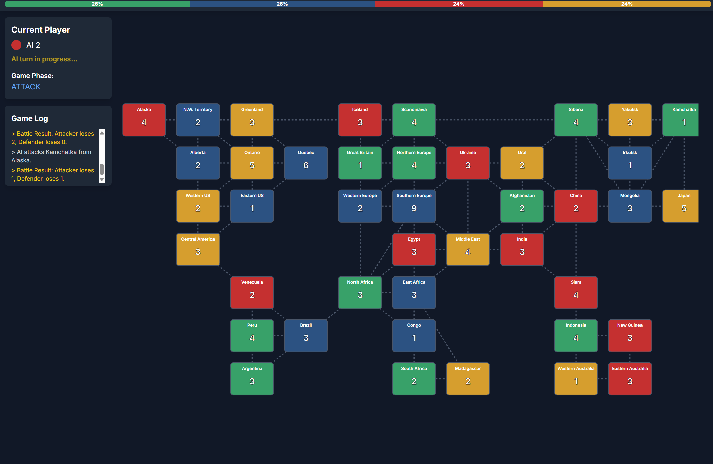

# RETRO-RISK.NEO



**RETRO-RISK.NEO** is a browser-based strategy game inspired by the classic board game *Risk*, re-imagined with a high-contrast Cyberpunk/CRT aesthetic. Command your troops, conquer territories, and dominate the world grid against AI opponents.

## Features

-   **Neon CRT Aesthetic:** Scanlines, glow effects, and a retro-terminal interface.
-   **Classic Gameplay Loop:**
    -   **Deploy:** Reinforce your territories based on controlled regions and continent bonuses.
    -   **Attack:** Dice-based combat system to conquer neighboring sectors.
    -   **Fortify:** Strategic movement of troops to secure your borders before ending your turn.
-   **AI Opponents:** Play against up to 5 CPU players.
-   **Dynamic Map:** Grid-based rendering of the classic world map layout.

## Project Structure

This project is set up as a modern Vite application, ready for deployment.

-   `src/main.js`: Core game logic (Game loop, AI, rendering).
-   `src/style.css`: Visual styling, CRT effects, and animations.
-   `index.html`: Main entry point and DOM structure.

## Getting Started

### Prerequisites

-   [Node.js](https://nodejs.org/) (Version 16 or higher recommended)

### Installation

1.  Clone the repository:
    ```bash
    git clone https://github.com/your-username/retro-risk-neo.git
    cd retro-risk-neo
    ```

2.  Install dependencies:
    ```bash
    npm install
    ```

### Local Development

Start the development server:

```bash
npm run dev
```

Open your browser to the URL provided in the terminal (usually `http://localhost:5173`).

## Deployment (Netlify)

This package is configured for easy deployment on Netlify.

1.  **Build the project:**
    ```bash
    npm run build
    ```
    This creates a `dist` folder containing the optimized production files.

2.  **Netlify Configuration:**
    The project includes a `netlify.toml` file that handles build settings and redirects automatically.

3.  **Deploy:**
    Link your repository to Netlify, or drag and drop the `dist` folder into the Netlify manual deploy interface.

## Credits

-   Built with Vanilla JavaScript & [Vite](https://vitejs.dev/)
-   Styling utilities provided by [Tailwind CSS](https://tailwindcss.com/)
-   Font: "VT323" from Google Fonts
